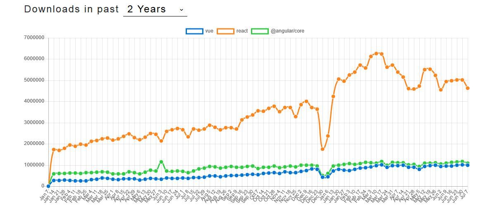

# Target
El objetivo de este .. es analizar registro de commits de un repositorio ( git log ) con el fin de extraer informacion acerca del proceso de desarrollo, el equipo de desarrolladores y los componentes desarrollados.

# Frameworks Repositories

Para el proyecto vamos a aplicar el mismo analisis a diferentes repositorios:
- Angular: https://github.com/angular/angular
- React: https://github.com/facebook/react
- Vue: https://github.com/vuejs/vue

Observando las tendencias de NPM podemos obtener una vista de las descargas, issus y numero de commits.
https://www.npmtrends.com/vue-vs-react-vs-@angular/core




# 1. Log
Extract the log for the cloned repository
```
git clone https://github.com/vuejs/vue.git ./repository/vue_cloned
node scripts/1-load_git-log.js vue_cloned
```

# 2. Team/Users
Extract the authors/contributors of a repository

### Git filters
- https://help.github.com/en/articles/searching-users  

```
type:user "fjc0kb" in:email
```

# 3. Issues/Tickets
Normalmente las tareas en un proyecto van asociadas a algun tipo de registro. Las tareas pueden ser de nuevo desarollo de componentes o funciones (features) o correccion de errores (issues,bugs).

La intencion de este bloque es agrupar los commits en tareas y subtareas.

## Steps:
1. Extract a file with all the tickets references
2. Link items with a parent element, to have relationship between elements
3. Link commits to Tickets to extend theinformation of commits:
  - Type task
  - Team
  - Times

### Tasks Manager

#### Git Issues

- https://help.github.com/en/articles/searching-issues-and-pull-requests

#### JIRA Issues
- https://confluence.atlassian.com/jirasoftwarecloud/searching-for-issues-764478280.html

**Example JIRA Filter**   
```
'Epic Link'= SUFFIX-01235 OR issueFunction in subtasksOf("\"Epic Link\"=SUFFIX-01235")
```

## Frameworks Issues

- Angular: https://github.com/angular/angular/issues
- React: https://github.com/facebook/react/issues/
- Vue:  https://github.com/vuejs/vue/issues/

Ejemplo de ruta de issue
```
https://github.com/vuejs/vue/issues/10191
```

# Usage

```
node ./scripts/9-report-01.js angular
```
